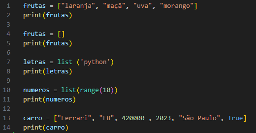

# bootcamp-ciencia-de-dados-com-python
Bootcamp Santander - Ciência de Dados utilizando a linguagem python.

<h1 align="center">Conteúdos :books:</h1> 

###  Prepare-se para a jornada:
1. Organizando seus estudos com Roadmaps DIO e Notion
2. Versionamento de código com Git e GitHUb
3. Desafios de projeto: crie um portifólio vencedor
4. Contribuindo em um projeto Open Source no Git

### Introdução a Ciência de Dados e Python
5. Ambiente de desenvolvimento e primeiros passos com Python
6. Conhecendo a linguagem de programação Python
7. Tipos de operadores com Python
8. Estruturas condicionais e de repetição em Python
9. Manipulando strings com Python
10. Trabalhando com listas em Python
11. Conhecendo tuplas em Python
12. Explorando conjuntos em Python
13. Aprendendo a utilizar dicionários em Python
14. Dominando funções Python
15. Explorando IA generativa em um pepiline de ETL com Python

### Resolvendo Seus Primeiros Desafios de Código
16. Aperfeiçoe a sua lógica e pensamento computacional
17. Equilibrando saldo
18. Organizando seus ativos
19. Condicionalmente rico
20. Juros compostos
21. O grande depósito

### Primeiros Passos em SQL e NoSQL

_______
<h3 align="center"> Organizando seus estudos com Roadmaps DIO e Notion</h3>
O Roadmap é uma estratégia para projetos. Como o nome já dá a entender, funciona como um mapa rodoviário: ele se volta para a indicação de qual é o ponto de partida e o de chegada.

Portanto, quando falamos em roadmap de projetos estamos nos referindo a um mapa que demonstra todos os passos necessários desde a concepção da ideia até a concretização dele. Com isso, oferece aos envolvidos informações completas e o trajeto entre o início do projeto e sua conclusão.

Existem vários pontos importantes nessa estratégia, para assim facilitar a conquista de seu objetivo. Os principais dele são:
- Conhecer seu projeto;
- Esclarecer o projeto a todos os envolvidos;
- Prever eventuais problemas;
- Facilitar a revisão do projeto;
- Alcançar melhores resultados;

Para também ajudar na organização e distribuição de tarefas podemos utilizar o Notion. Ele é excelente para equipes cujos componentes não trabalham todos no mesmo lugar e para home office, se destacando especialmente porque permite que haja o acesso a documentos, agenda e lembretes em um só lugar. Além disso, mais de um colaborador pode ter acesso às páginas, adicionar comentários ou alterações, assim como somar ao trabalho.

Dentre algumas ações que pode se fazer com o Notion estão:
- Fazer uma lista de tarefas;
- Compartilhar páginas;
- Integrar o Notion ao Google Drive;
- Ativar lembretes;
- Fazer o controle do tempo das atividades;

<h3 align="center"> Versionamento de código com Git e GitHub</h3>

<h2 align="center">2. Introdução a Ciência de Dados :game_die:</h2>
<h3 align="center">6. Trabalhando com listas em Pyhton</h3>

<h4 align="center"><strong>Criando Listas</strong></h4>

Uma lista em Python nada mais é do que uma lista comum. Por exemplo, quando você faz uma lista de compras, isso é uma lista, e no Python é a mesma coisa! Podemos listar todas as informações dentro de uma única variável e depois utilizar essas informações dentro do nosso código.
Para criar listas no Python é necessário:
- Utilizar o símbolo [ ] (colchetes) para as listas;
- Armazenar a lista em uma VARIÁVEL;
- Separar itens da lista pela vírgula;
- Também pode-se usar o construtor list ou a função range.
- Além disso as listas são objetos mutáveis, então podemos alterar seus valores após a criação.

Exemplos de criação de listas:

